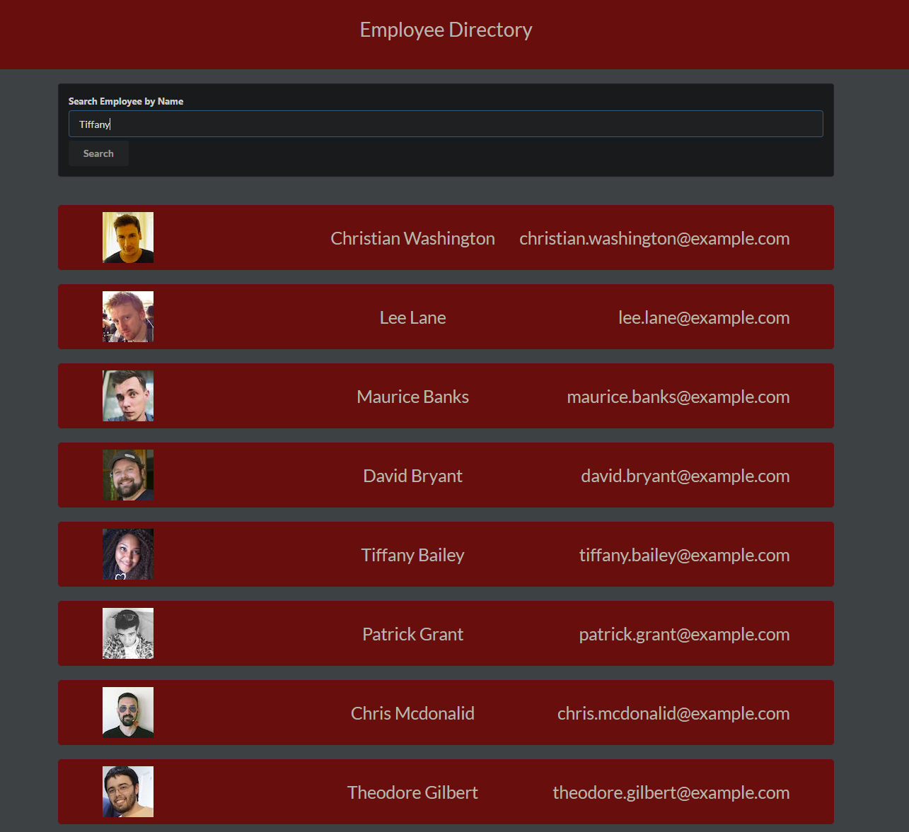

# Employee Directory

## Table of Contents

[Description](#description)

[Contributing](#contributing)

[Questions](#questions)

## Description

A simple employee directory. The app was created using React, axios, and randomuser API for collecting dummy data. A random selection of 50 employees is populated upon the first page load. Users can view the names, emails and profile pictures of each employee and search employees by first or last name.

[Link to random user API](https://randomuser.me/)

The application was deployed using Heroku: https://desolate-tundra-52266.herokuapp.com/

## Contributing

Not accepting pull requests at this time.

## Questions

###### For questions, please contact me at tldavis09@yahoo.com

